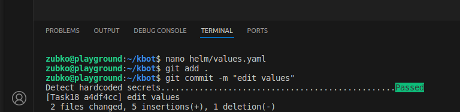
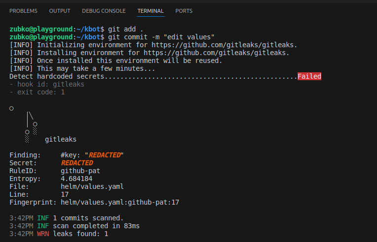

```[code]

# Отримання значення конфігурації git для hooks.gitleaks
ENABLE_GITLEAKS=$(git config --bool hooks.gitleaks)

# Перевірка, чи гіт-хук gitleaks включений; якщо ні, виводиться повідомлення та завершується виконання
if [ "$ENABLE_GITLEAKS" != "true" ]; then
  echo "Gitleaks hook is disabled. Enable it by running:"
  echo "git config --bool hooks.gitleaks true"
  exit 0
fi

# Функція для визначення операційної системи
check_os() {
  # Визначення операційної системи з використанням команди uname
  if [ "$(uname)" = "Darwin" ]; then
    OS='Darwin'
  elif [ "$(uname)" = "Windows_NT" ]; then
    OS='Windows'
  elif [ "$(uname)" = "Linux" ]; then
    OS='Linux'
  else
    OS='Unknown'
  fi
}

# Функція для визначення архітектури
check_arch() {
  # Визначення архітектури з використанням команди uname -m
  ARCH="$(uname -m)"
  if [ "$ARCH" = "x86_64" ]; then
    ARCH='x86_64'
  elif [ "$ARCH" = "arm64" ]; then
    ARCH='arm64'
  else
    ARCH='Unknown'
  fi
}

# Функція для встановлення gitleaks
install_gitleaks() {
  check_os  # Визначення операційної системи
  check_arch  # Визначення архітектури

  # Перевірка, чи операційна система або архітектура не відомі
  if [ "$OS" = "Unknown" ] || [ "$ARCH" = "Unknown" ]; then
    echo "Unsupported OS or architecture"
    exit 1
  fi

  # Визначення URL для завантаження gitleaks залежно від ОС та архітектури
  if [ "$OS" = "Windows" ]; then
    ARCH='x86_64'
    URL="https://github.com/gitleaks/gitleaks/releases/latest/download/gitleaks-windows-amd64.exe"
  elif [ "$OS" = "Linux" ]; then
    if [ "$ARCH" = "x86_64" ]; then
      URL="https://github.com/gitleaks/gitleaks/releases/latest/download/gitleaks-linux-amd64"
    elif [ "$ARCH" = "arm64" ]; then
      URL="https://github.com/gitleaks/gitleaks/releases/latest/download/gitleaks-linux-arm64"
    fi
  elif [ "$OS" = "Darwin" ]; then
    if [ "$ARCH" = "x86_64" ]; then
      URL="https://github.com/gitleaks/gitleaks/releases/latest/download/gitleaks-darwin-amd64"
    elif [ "$ARCH" = "arm64" ]; then
      URL="https://github.com/gitleaks/gitleaks/releases/latest/download/gitleaks-darwin-arm64"
    fi
  fi

  # Завантаження gitleaks та розміщення його у відповідних місцях
  echo "Downloading gitleaks from $URL..."
  if [ "$OS" = "Windows" ]; then
    curl -sSL "$URL" -o gitleaks.exe
    mkdir -p "$LOCALAPPDATA/gitleaks"
    move gitleaks.exe "$LOCALAPPDATA/gitleaks/gitleaks.exe"
    GITLEAKS_PATH="$LOCALAPPDATA/gitleaks/gitleaks.exe"
  else
    curl -sSL "$URL" -o gitleaks
    chmod +x gitleaks
    sudo mv gitleaks /usr/local/bin/gitleaks
    GITLEAKS_PATH="gitleaks"
  fi
}

## Перевірка наявності gitleaks та його встановлення, якщо потрібно
if ! command -v gitleaks >/dev/null 2>&1 && ! command -v "$LOCALAPPDATA/gitleaks/gitleaks.exe" >/dev/null 2>&1; then
  echo "Gitleaks not found, installing..."
  install_gitleaks
else
  ## Якщо gitleaks вже встановлений, визначається шлях до нього
  if [ "$(uname)" = "Windows_NT" ]; then
    GITLEAKS_PATH="$LOCALAPPDATA/gitleaks/gitleaks.exe"
  else
    GITLEAKS_PATH="gitleaks"
  fi
  echo "Gitleaks is already installed"
fi

exit 0
```
